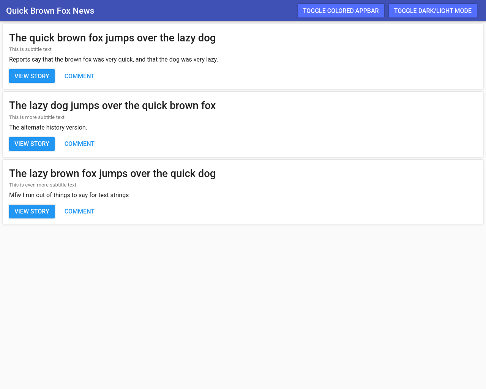

# minimaterials

*After minification

A tiny implementation of Material Design for use in lightweight web apps.

It's similar to Google's Material Design Lite, but minimaterials aims to:
- Support all Material Design versions (1, 2, and 3/You)
- Be smaller than Material Design Lite (or at least MD1)
- Be easier to write code for than Material Design Lite
- Support dynamic theme switching

minimaterials does *not* use NPM, however JavaScript is used to help reduce size.

# Building

You need GNU `make` and the `minify` CLI (The Go-based one, **NOT** the one from NPM).

To build a specific version of Material Design, simply do `make mdX`, where X is the Material version you need. For example, `make md1` will build the original Material from 2014, and `make md3` will build Material You.

To build all versions of Material Design (1, 2, and 3/You), run `make all`. It will bundle all the Material versions together into a single CSS file.

The result is `mm-X.min.css`, where X is either `md1`, `md2`, `md3`, or `all`.

# Screenshots

These screenshots were generated by the `screenshots` rule in the Makefile, which is dependent on `chromium`.

### Quick Brown Fox News (MD1, `doc/examples/basic-cards-appbar.html`)

# TODO

- [X] Build system
- [X] Bundling
- [X] Minification
- [ ] Material Design 1
    - [X] Typography
        - [X] Fonts
        - [X] Scale
    - [ ] Color
        - [ ] Complete rework
            - [X] Encoding
            - [X] Decoding
            - [X] Setting palettes
            - [ ] Decide on white/black text automatically
        - [X] Primary (19/19)
        - [X] Secondary (19/19)
    - [ ] Components
        - [X] App bar / Navbar
            - [X] Basic layout
            - [X] Shadows
            - [X] Theme colors (light/dark)
            - [X] Opposite theme colors (light/dark)
            - [X] Primary colors
        - [ ] Cards
            - [X] Theme colors (light/dark)
            - [X] Shadows
            - [X] Hover effects
            - [X] Text
            - [ ] Images
        - [ ] Buttons
            - [ ] Raised buttons
                - [ ] Theme colors (light/dark)
                - [ ] Primary colors (with a good system, unlike `.mm-appbar-button`)
                - [X] Secondary colors
                - [X] Shadows
                - [X] Look basically identical
                - [X] Hover effects
                - [ ] Click effects
                - [ ] Disabled buttons
            - [ ] Flat buttons
                - [ ] Theme colors (light/dark)
                - [ ] Primary colors
                - [X] Secondary colors
                - [X] Look basically identical
                - [X] Hover effects
                - [X] Click effects
                - [ ] Disabled buttons
            - [ ] Floating action buttons
        - [ ] Sliders
        - [ ] Checkboxes
        - [ ] Radio buttons
        - [ ] Switches
        - [ ] Lists
        - [ ] Tables
        - [ ] Text fields
        - [ ] Icons
        - [ ] Tooltips
        - [ ] Dialogs
        - [ ] Drawer / Sidebar
        - [ ] Dropdown menus
        - [ ] Loading indicators
        - [ ] Toasts & Snackbars
- [ ] Material Design 2
- [ ] Material Design 3/You